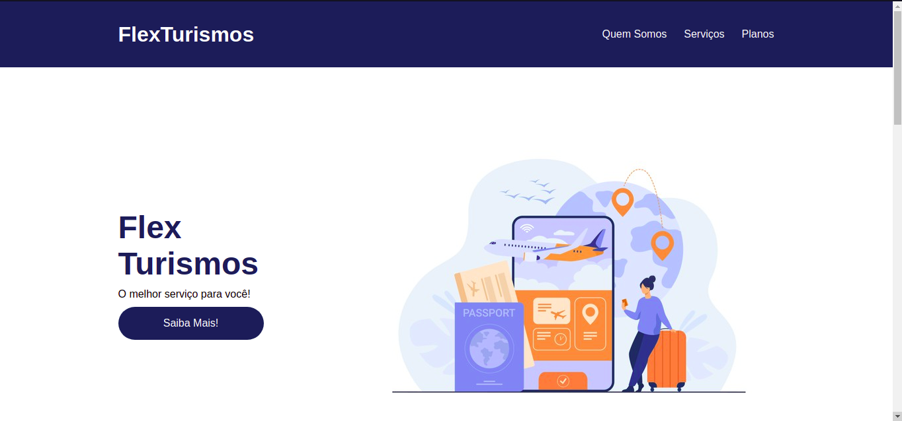

# Flex Turismos
Projeto realizado na Digital Innovation One para solidificação dos conhecimentos em Flexbox.

  

## 🚀 Tecnologias

Esse projeto foi desenvolvido com as seguintes tecnologias:

- HTML
- CSS

## 📚 O que aprendi:
- Reforcei conteúdos de CSS
- Solidifiquei meus conhecimentos em Flexbox
